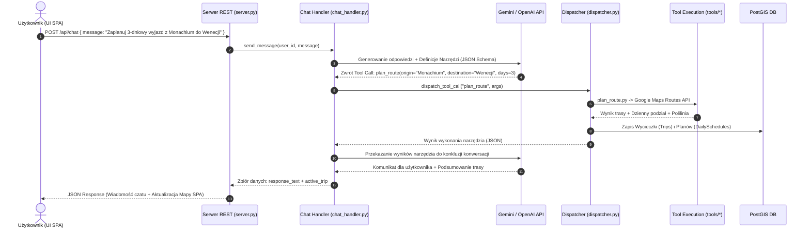
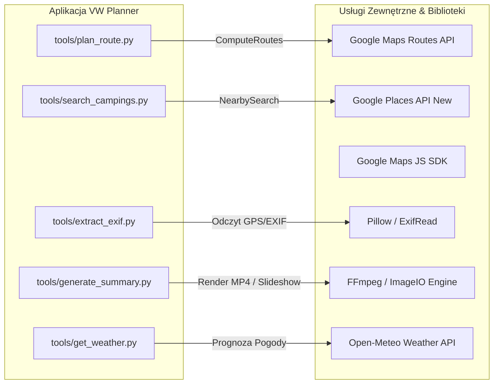

# 🚐 VW California AI Trip Planner — Dogłębna Dokumentacja Architektoniczna Systemu

> **Wersja:** 2.0.0  
> **Status:** Produkcyjna / Standard A.N.T. 3-Layer  
> **Data ostatniej aktualizacji:** 31 Lipca 2026  
> **Autor:** Antigravity AI Engineering Team  

---

## 1. Wstęp i Wizja Architektoniczna (Executive Summary & North Star)

### 1.1 Misja Systemu
**VW California AI Trip Planner with Travel Memory** to zaawansowany system cyfrowy zaprojektowany specjalnie dla społeczności właścicieli vanów kempingowych **Volkswagen California**. Aplikacja łączy w sobie inteligencję konwersacyjną sztucznej inteligencji (LLM Gemini / OpenAI), silnik analizy przestrzennej (PostGIS & Google Maps Platform) oraz automatyczny dziennik podróży (*Travel Memory*).

Aplikacja rozwiązuje kluczowe wyzwania podróżowania vanem kempingowym:
1. **Dopasowanie gabarytów i infrastruktury:** Automatyczne filtrowanie kempingów pod kątem wymagań VW California (przyłącze prądu 230V / *shore power*, poziomowanie terenu, dopuszczalna długość pojazdu).
2. **Bezpieczne tempo podróży:** Respektowanie dziennych limitów czasowych (max 6h jazdy) i inteligentny podział długich tras na logiczne etapy dzienne.
3. **Automatyzacja wspomnień:** Przestrzenno-czasowa korelasja zdjęć z smartfona (EXIF GPS) z trasą przejazdu w czasie rzeczywistym.
4. **Ekspresja marki VW:** Wykorzystanie dedykowanego języka designu i wytycznych wizualnych Volkswagen California.

### 1.2 Kluczowe Filary Architektury
- **Wzorzec A.N.T. 3-Layer:** Pełna rozdzielczość standardów (Architecture/SOP), orkiestracji (Navigation) oraz wykonywania działań (Tools).
- **Zasada Single Source of Truth (SSOT):** Baza danych PostgreSQL + PostGIS stanowi jedyne oficjalne źródło prawdy dla tras, noclegów, profilu użytkownika i zdjęć.
- **Konwersacyjny Slot-Filling & Self-Healing:** Naturalny interfejs językowy wyciągający niezbędne intencje z wbudowanym mechanizmem automatycznej naprawy błędów zewnętrznych API.
- **Prywatność i Przestrzeń (PostGIS):** Wykorzystanie obliczeń przestrzennych na poziomie bazy danych (`ST_DWithin`, indeksy GiST) dla gwarancji wydajności przy rosnącym wolumenie zdjęć.

---

## 2. Wzorzec Architektoniczny A.N.T. (3-Layer Architecture)

Struktura projektu opiera się na **Trójwarstwowym Modelu A.N.T. (Architecture, Navigation, Tools)**, który separuje definicje biznesowe od logiki podejmowania decyzji i narzędzi wykonawczych.

```mermaid
graph TD
    subgraph Layer 1: Architecture - Standardy SOP / architecture/
        A1[routing_sop.md]
        A2[camping_search_sop.md]
        A3[travel_memory_sop.md]
        A4[chat_orchestration_sop.md]
        A5[summary_export_sop.md]
    end

    subgraph Layer 2: Navigation - Orkiestracja i Kontrola / navigation/ & server.py
        B1[server.py - REST API / Flask]
        B2[chat_handler.py - Konwersacja & Prompty]
        B3[dispatcher.py - Function Calling & Dispatching]
    end

    subgraph Layer 3: Tools - Deterministyczne Narzędzia Atomowe / tools/
        C1[plan_route.py]
        C2[search_campings.py]
        C3[suggest_attractions.py]
        C4[extract_exif.py]
        C5[memory_logger.py]
        C6[generate_summary.py]
        C7[get_weather.py]
        C8[db.py - SQLAlchemy & PostGIS]
    end

    Layer 1 -. Standardy i Reguły Biznesowe .-> Layer 2
    Layer 2 -->|Decyzje i Wywołania| Layer 3
    Layer 3 -->|Persystencja i Odczyt| D[(PostgreSQL 15 + PostGIS)]
    Layer 3 -->|Usługi Zewnętrzne| E[Google Maps / Open-Meteo API]
```

### 2.1 Warstwa 1: Architecture (Standard Operating Procedures - SOP)
Warstwa dokumentacyjno-decyzyjna zlokalizowana w katalogu `architecture/`. Określa bezwzględne reguły, którymi muszą kierować się pozostałe warstwy:
- `routing_sop.md`: Maksymalnie 6h jazdy dziennie, obowiązkowe przystanki co 2-3h, kalkulacja trasy powrotnej.
- `camping_search_sop.md`: Kryteria oceny kempingów, priorytetowanie przyłączy prądu (*shore power*) i infrastruktury bocznej.
- `travel_memory_sop.md`: Algorytmy tolerancji przestrzennej (promień 5km od polilinii trasy) i czasu (okno 2h od przystanku).
- `chat_orchestration_sop.md`: Wytyczne konwersacyjne, holistic slot-filling (dopytywanie o brakujące dane w jednej zwięzłej wiadomości) i ton wypowiedzi marki VW.
- `summary_export_sop.md`: Specyfikacja formatów podsumowań (slideshow, wideo MP4 z FFmpeg, raport PDF).

### 2.2 Warstwa 2: Navigation (Orkiestracja i Zarządzanie Przepływem)
Odpowiada za interpretację intencji użytkownika, utrzymanie stanu sesji i delegowanie zadań do narządzi atomowych:
- [server.py](file:///Users/mateuszszymkowiak/Documents/GitHub/VW/tools/server.py): Główny punkt wejścia serwera Flask, wystawiający końcówki REST API, obsługujący sesje użytkowników, autentykację oraz statyczne pliki SPA.
- [chat_handler.py](file:///Users/mateuszszymkowiak/Documents/GitHub/VW/navigation/chat_handler.py): Zarządza konwersacją z Gemini/OpenAI API, utrzymuje historię rozmowy w pamięci serwera (`_CHAT_SESSIONS`) i konstruuje prompter systemowy marki VW.
- [dispatcher.py](file:///Users/mateuszszymkowiak/Documents/GitHub/VW/navigation/dispatcher.py): Odczytuje funkcje (*Function Calling*) zwrócone przez LLM, dopasowuje parametry i wywołuje odpowiednie moduły z Warstwy 3, zamykając pętlę odpowiedzi.

### 2.3 Warstwa 3: Tools (Deterministyczne Narzędzia Atomowe)
Niezależne, wysoce wyspecjalizowane moduły w katalogu `tools/`:
- [plan_route.py](file:///Users/mateuszszymkowiak/Documents/GitHub/VW/tools/plan_route.py): Wyznacza trasy przez Google Maps Routes API, kalkuluje czas/dystans, rozbija wyjazd na dni i generuje podsumowanie etapów.
- [search_campings.py](file:///Users/mateuszszymkowiak/Documents/GitHub/VW/tools/search_campings.py): Przeszukuje lokalną bazę PostGIS, a w przypadku braku wyników automatycznie odwołuje się do Google Places API (*Nearby Search*).
- [suggest_attractions.py](file:///Users/mateuszszymkowiak/Documents/GitHub/VW/tools/suggest_attractions.py): Odnajduje atrakcje turystyczne i punkty widokowe w buforze geograficznym trasy z mechanizmem cache'owania w pamięci serwera (`_ATTRACTIONS_CACHE`).
- [extract_exif.py](file:///Users/mateuszszymkowiak/Documents/GitHub/VW/tools/extract_exif.py): Parsuje pliki graficzne JPEG/PNG przy użyciu Pillow, wyciągając tagi EXIF GPS (konwersja DMS do stopni dziesiętnych) oraz datę wykonania.
- [memory_logger.py](file:///Users/mateuszszymkowiak/Documents/GitHub/VW/tools/memory_logger.py): Dopasowuje przesłane zdjęcia do wyznaczonej polilinii trasy w PostGIS przy użyciu relacji przestrzennej `ST_DWithin`.
- [generate_summary.py](file:///Users/mateuszszymkowiak/Documents/GitHub/VW/tools/generate_summary.py): Tworzy materiały podsumowujące (slideshow HTML, dynamiczne renderowanie wideo MP4 z podkładem muzycznym via FFmpeg, dokumenty PDF z FPDF).
- [get_weather.py](file:///Users/mateuszszymkowiak/Documents/GitHub/VW/tools/get_weather.py): Odpytuje Open-Meteo API o prognozę pogody dla punktów etapowych trasy.
- [db.py](file:///Users/mateuszszymkowiak/Documents/GitHub/VW/tools/db.py): Utrzymuje pulę połączeń z bazą danych PostgreSQL via SQLAlchemy Engine.

---

## 3. Architektura Danych i Baza PostGIS (Data Architecture)

Model danych zaprojektowano w relacyjno-przestrzennym silniku **PostgreSQL 15 z rozszerzeniem PostGIS 3**, co umożliwia wykonywanie zapytań geograficznych o wysokiej wydajności.

### 3.1 Diagram Schematu Bazy Danych (ERD)

```mermaid
erDiagram
    users ||--o{ trips : "tworzy"
    users ||--o{ photos : "posiada"
    users ||--o{ trip_summaries : "generuje"
    users ||--o{ chat_messages : "prowadzi"
    trips ||--o{ daily_schedules : "składa się z"
    trips ||--o{ photos : "zawiera"
    trips ||--o{ chat_messages : "dotyczy"
    trips ||--o{ trip_summaries : "podsumowuje"
    campings ||--o{ daily_schedules : "jest noclegiem dla"
    daily_schedules ||--o{ photos : "jest powiązany z"

    users {
        uuid id PK
        string email UK
        string password_hash
        string display_name
        string vehicle_model
        numeric max_daily_drive_hours
        string_array preferred_amenities
        numeric budget_per_night_eur
        string hookup_type
        jsonb preferences_json
        timestamp created_at
    }

    trips {
        uuid id PK
        uuid user_id FK
        string title
        string description
        string origin_label
        numeric origin_lat
        numeric origin_lng
        string destination_label
        numeric destination_lat
        numeric destination_lng
        date start_date
        date end_date
        string status
        timestamp created_at
    }

    campings {
        uuid id PK
        string name
        geography location GIS
        numeric lat
        numeric lng
        string place_id
        string address
        string country
        numeric cost_per_night_eur
        boolean has_power
        boolean has_water
        boolean has_wifi
        boolean has_showers
        boolean has_toilets
        boolean has_waste_disposal
        boolean shore_power_hookup
        numeric max_vehicle_length_m
        boolean level_ground
        numeric rating
        integer review_count
        string_array photos
        string source
    }

    daily_schedules {
        uuid id PK
        uuid trip_id FK
        integer day_number
        date schedule_date
        numeric driving_hours
        numeric driving_km
        jsonb waypoints
        uuid overnight_camping_id FK
        text route_polyline
    }

    photos {
        uuid id PK
        uuid user_id FK
        uuid trip_id FK
        string file_url
        string thumbnail_url
        geography location GIS
        numeric lat
        numeric lng
        timestamp captured_at
        string camera_make
        string camera_model
        integer orientation
        string original_filename
        string caption
        uuid tagged_day_schedule_id FK
        timestamp created_at
    }

    chat_messages {
        uuid id PK
        uuid trip_id FK
        uuid user_id FK
        string role
        text content
        jsonb tool_calls
        timestamp created_at
    }

    trip_summaries {
        uuid id PK
        uuid trip_id FK
        uuid user_id FK
        string format
        string file_url
        string music_track
        boolean include_map_animation
        boolean include_photos
        timestamp generated_at
    }

    interaction_logs {
        uuid id PK
        text user_message
        text model_response
        timestamp created_at
    }
```

### 3.2 Przestrzenne Indeksowanie i Zapytania GIS
1. **GiST Indexes:** Obiekty z kolumną typu `GEOGRAPHY(POINT, 4326)` posiadają dedykowane indeksy przestrzenne GiST:
   ```sql
   CREATE INDEX idx_campings_location ON campings USING GIST(location);
   CREATE INDEX idx_photos_location ON photos USING GIST(location);
   ```
2. **Korelacja Przestrzenna Zdjęć (ST_DWithin):** Przypisywanie zdjęcia do trasy na podstawie odległości geograficznej w metrach:
   ```sql
   SELECT p.id, p.file_url 
   FROM photos p
   WHERE ST_DWithin(
       p.location,
       ST_SetSRID(ST_MakePoint(:lng, :lat), 4326)::geography,
       5000 -- Promień 5 km
   );
   ```

---

## 4. Architektura Komunikacji i Moduł AI (AI & Navigation Layer)

Moduł AI wykorzystuje silnik **Google Gemini API** (z płynnym przełączaniem na protokół OpenAI API w zależności od dostępnych kluczy), wdrażając zaawansowany wzorzec **Holistic Slot Filling**.

### 4.1 Schemat Przetwarzania Intencji (Function Calling Flow)



### 4.2 Narzędzia AI (Gemini Tools Registry)
Zarejestrowane struktury narzędzi dostępne dla sztucznej inteligencji:
- `search_campings`: Wyszukiwanie noclegów z filtrami (prąd, woda, Wi-Fi, cena).
- `plan_route`: Kalkulacja głównej trasy z podziałem na dni i limity jazdy.
- `add_waypoint`: Dodawanie pośrednich przystanków/atrakcji do konkretnego dnia.
- `adjust_schedule`: Modyfikacja czasu jazdy lub zmiana kolejności etapów.
- `suggest_attractions`: Propozycje ciekawych miejsc wzdłuż danej sekcji trasy.
- `get_weather`: Sprawdzanie prognozy pogodowej dla wybranego obszaru.

---

## 5. Architektura Interfejsu Użytkownika (Frontend Architecture)

Aplikacja kliencka to zaawansowane **Single Page Application (SPA)** stworzone w czystym JavaScript (ES6+), HTML5 i Vanilla CSS3 z zachowaniem zasad **Volkswagen Brand Guidelines**.

### 5.1 Struktura Komponentów Frontendowych

```
frontend/
├── index.html              # Główny kontener aplikacji SPA
├── styles.css              # System styli VW (Zmienne CSS, Dark Mode, Glassmorphic UI)
├── app.js                  # Główny kontroler aplikacji i zarządca stanu
├── i18n.js                 # Moduł internacjonalizacji (PL, EN, DE)
├── manifest.json           # Manifest PWA
└── components/             # Reużywalne moduły interfejsu
    ├── MapManager.js       # Kontroler Google Maps JS SDK (Trasy, Polilinie, Markery)
    ├── ChatManager.js      # Kontroler interfejsu czatu AI i wiadomości głosowych
    ├── TravelMemory.js     # Galeria pamiątek i czytnik EXIF
    ├── RouteView.js        # Interaktywny widok osi czasu trasy i atrakcji
    └── SummaryModal.js     # Odtwarzacz podsumowań i generator wideo/PDF
```

### 5.2 System Designu i Brand Guidelines VW
Aplikacja rygorystycznie przestrzega wytycznych **Volkswagen California Design System**:

```css
:root {
  --vw-primary: #001E50;       /* Deep VW Blue */
  --vw-secondary: #000E26;     /* Dark Night Blue */
  --vw-accent: #0000EE;        /* Vibrant Blue Accent */
  --vw-background: #FFFFFF;    /* Clean Canvas */
  --vw-text: #000000;          /* High Contrast Text */
  --vw-font-head: 'vw-head', 'Helvetica Neue', Arial, sans-serif;
  --vw-font-body: 'vw-text', 'Helvetica Neue', Arial, sans-serif;
  --vw-border-radius: 8px;
  --vw-spacing-unit: 4px;
}
```

---

## 6. Integracje Zewnętrzne i Pipeline Multimedialny

System integruje wyspecjalizowane usługi zewnętrzne dla zagwarantowania kompleksowej obsługi podróży:



### 6.1 Proces Przetwarzania Wideo Podsumowania (FFmpeg Pipeline)
Generowanie końcowych plików wideo pamiątkowych przebiega według następujących etapów:
1. **Aggregating Assets:** Pobranie polilinii trasy, listy odwiedzonych noclegów oraz zdjęć z metadanymi z PostGIS.
2. **Frame Generation:** Wyrenderowanie klatek mapy (Google Maps Static API) oraz nałożenie paneli ze zdjęciami użytkownika.
3. **FFmpeg Compilation:** Połączenie sekwencji obrazów w strumień wideo H.264 z rozdzielczością 1080p, dodanie przejść typu *fade/crossfade* oraz miksowanie ścieżki dźwiękowej MP3.

---

## 7. Bezpieczeństwo, Niezawodność i Self-Healing

### 7.1 Bezpieczeństwo i Uczulenia (Security Model)
- **Autentykacja:** Rejestracja i logowanie użytkowników z wykorzystaniem bezpiecznego haszowania haseł `pbkdf2:sha256` z solą (Werkzeug Security).
- **Zarządzanie Sesją:** Odizolowanie historii rozmów AI w pamięci serwera (`_CHAT_SESSIONS`), chroniące przed przekroczeniem limitu ciasteczek Flask (`4093 bytes limit`).
- **Ochrona Zmiennych Środowiskowych:** Wszystkie klucze dostępowe (`GEMINI_API_KEY`, `GOOGLE_MAPS_KEY`, `DATABASE_URL`) przechowywane w bezpiecznym pliku `.env` poza repozytorium.

### 7.2 Niezawodność i Self-Healing (Graceful Fallback)
1. **Google Maps Fallback dla Bazy Kempingów:** W przypadku braku dopasowania noclegu w lokalnej bazie PostGIS, system automatycznie odpytuje Google Places API, pobiera najnowsze obiekty i uzupełnia bazę danych *on-the-fly*.
2. **Obsługa Błędów LLM:** W przypadku przekroczenia limitu zapytań (Rate Limit) lub niedostępności modelu Gemini, interfejs konwersacyjny przełącza się na alternatywne wywołania narzędzi deterministycznych z informacją dla użytkownika.

---

## 8. Plany Rozwoju i Rozbudowy (Roadmap & Architectural Evolution)

1. **Wdrożenie Konteneryzacji Docker:** Spakowanie aplikacji Flask, PostgreSQL/PostGIS oraz biblioteki FFmpeg do jednolitego kontenera `docker-compose.yml`.
2. **Offline-First PWA:** Rozbudowa Service Workera o wsparcie dla zapisu trasy i map offline na wypadek braku zasięgu w trakcie jazdy vanem.
3. **Integracja z Szyną CAN / OBD-II VW:** Automatyczne pobieranie stanu naładowania akumulatora pomocniczego i poziomu wody w vanie VW California bezpośrednio do planera.

---

> **Dokument zatwierdzony przez:** Lead System Architect  
> **Zgodność ze standardem A.N.T. 3-Layer:** 100%  
